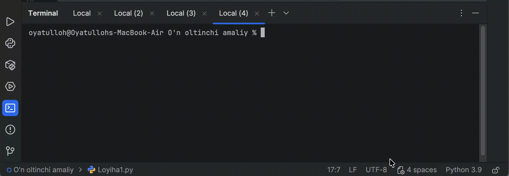

# Kompozitsiya: Avtomobil + Dvigatel

Bu loyiha Python dasturlash tilida **Obyektlar Kompozitsiyasi** prinsipini o'rganish uchun yaratilgan amaliy loyiha.

## Loyiha maqsadi

Avtomobil va Dvigatel (Motor) klasslari misolida kompozitsiya orqali qanday qilib real obyektlar modellashtirilishini amaliy ko'rsatish. Loyiha boshlang'ich darajadagi o'quvchilar uchun mo'ljallangan.

## Loyiha xususiyatlari

### Asosiy funksiyalar:
- **Grafikli foydalanuvchi interfeysi (GUI)** - zamonaviy va qulay dizayn
- **Avtomobil qo'shish** - yangi avtomobil va uning dvigatelini qo'shish
- **Avtomobil yangilash** - mavjud avtomobil ma'lumotlarini tahrirlash
- **Avtomobil o'chirish** - ro'yxatdan avtomobilni olib tashlash
- **Qidiruv va filtrlash** - avtomobillarni turli kriteriyalar bo'yicha qidirish
- **Ma'lumotlarni saqlash** - barcha ma'lumotlarni JSON faylga saqlash
- **Ma'lumotlarni yuklash** - saqlangan ma'lumotlarni avtomatik yuklash

### Kompozitsiya tamoyili:
- `Avtomobil` klassi `Dvigatel` obyektini o'z ichiga oladi
- Har bir avtomobil yaratilganda, unga `Dvigatel` obyekti argument sifatida uzatiladi
- Bu kompozitsiya tamoyilining amaliy namoyishi

## Fayllar tuzilishi

```
O'n oltinchi amaliy/
├── Loyiha1.py              # Oddiy konsol dasturi (asosiy misol)
├── interfeys.py            # To'liq GUI dasturi (asosiy dastur)
├── yangi.py                # Alternativ GUI dasturi
├── avtomobillar_data.json  # Saqlangan ma'lumotlar fayli
├── README.md               # Loyiha hujjatlari
└── natija.gif              # Dastur ishlashidan namuna
```

## Qanday ishlatishingiz mumkin?

### 1. Loyihani ko'chirib oling:
```bash
git clone https://github.com/oyatulloh765/loyiha_ishi.git
```

### 2. Loyiha papkasiga kiring:
```bash
cd loyiha_ishi
```

### 3. Dasturni ishga tushiring:

#### Asosiy GUI dasturi (tavsiya etiladi):
```bash
python interfeys.py
```

#### Oddiy konsol dasturi:
```bash
python Loyiha1.py
```

#### Alternativ GUI dasturi:
```bash
python yangi.py
```

## Dasturdan foydalanish

### `interfeys.py` - Asosiy GUI dasturi

1. **Avtomobil qo'shish:**
   - Chap paneldagi barcha maydonlarni to'ldiring
   - "Yaratish" tugmasini bosing

2. **Avtomobil tanlash va ko'rish:**
   - O'ng paneldagi ro'yxatdan avtomobilni tanlang
   - Tanlangan avtomobil ma'lumotlari avtomatik ko'rsatiladi

3. **Avtomobil yangilash:**
   - Avtomobilni tanlang
   - Maydonlarni o'zgartiring
   - "Yangilash" tugmasini bosing

4. **Avtomobil o'chirish:**
   - Avtomobilni tanlang
   - "O'chirish" tugmasini bosing
   - Tasdiqlang

5. **Qidiruv:**
   - Qidiruv maydoniga so'rov kiriting
   - "Qidirish" tugmasini bosing

6. **Ma'lumotlarni saqlash:**
   - "Saqlash" tugmasini bosing
   - Ma'lumotlar `avtomobillar_data.json` fayliga saqlanadi

## Texnologiyalar

- **Python 3.9+**
- **tkinter** - Grafikli foydalanuvchi interfeysi
- **json** - Ma'lumotlarni saqlash va yuklash
- **OOP (Object Oriented Programming)** - Obyektga yo'naltirilgan dasturlash tamoyillari

## O'rganiladigan tushunchalar

- Klasslar va obyektlar
- Kompozitsiya (Composition) tamoyili
- GUI dasturlash (tkinter)
- Fayllar bilan ishlash (JSON)
- Ma'lumotlar strukturasi (List, Dictionary)
- Event handling (Hodisalarni boshqarish)

## Klasslar tuzilishi

### `Dvigatel` klassi:
```python
class Dvigatel:
    def __init__(self, ishlab_chiqaruvchi, ot_kuchi, dvigatel_turi):
        self.ishlab_chiqaruvchi = ishlab_chiqaruvchi
        self.ot_kuchi = ot_kuchi
        self.dvigatel_turi = dvigatel_turi
```

### `Avtomobil` klassi:
```python
class Avtomobil:
    def __init__(self, model, rang, yil, dvigatel):
        self.model = model
        self.rang = rang
        self.yil = yil
        self.dvigatel = dvigatel  # Kompozitsiya!
```

## Dastur ko'rinishi

Dastur zamonaviy va professional dizaynga ega:
- To'q ko'k-qizil rang sxemasi
- Ikki ustunli tartib (forma va ro'yxat)
- Qulay foydalanish interfeysi



## Loyiha topshirig'ini bajaruvchi

**Muxtorov Oyatullo & Abdumajidov Doniyor & Tojiahmadov Mo'sajon & Tojialiyev Muhammad Ali& Abdullayev Ahliddin**

## Litsenziya

Bu loyiha o'quv maqsadida yaratilgan.

## Hissa qo'shish

Agar loyihani yaxshilash bo'yicha takliflaringiz bo'lsa, pull request yuborishingiz mumkin!

---

Agar loyiha sizga foydali bo'lsa, star qo'yishni unutmang!
